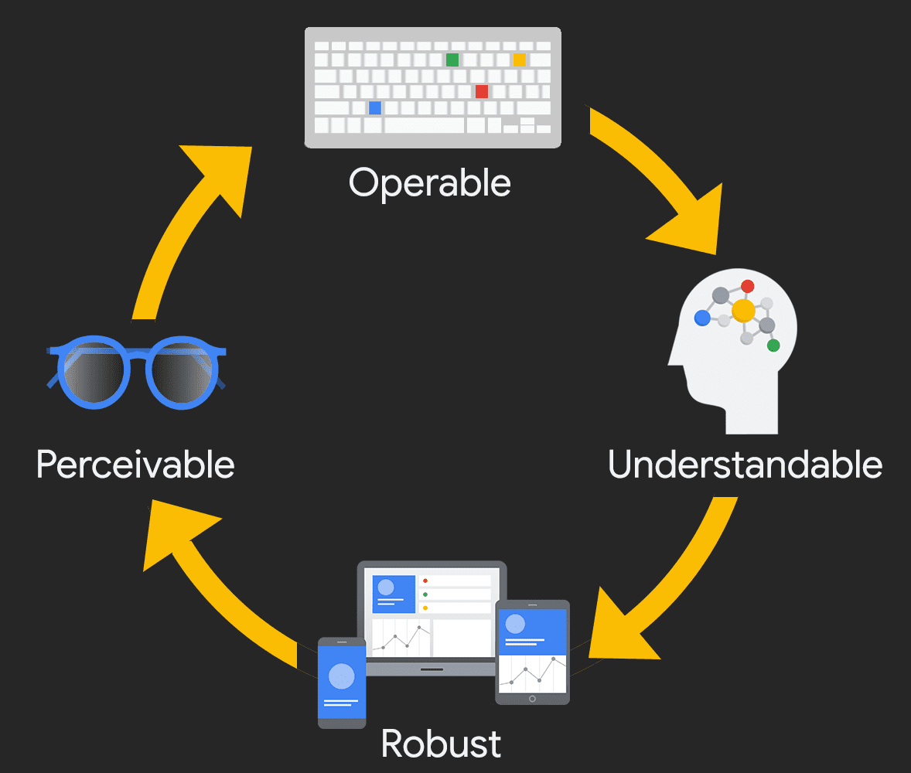

# Khả năng tiếp cận kỹ thuật số được đo lường như thế nào?

## Tổng quan

Khả năng tiếp cận kỹ thuật số là thiết kế và xây dựng các dịch vụ kỹ thuật số sao cho mọi người, bất kể khả năng tinh thần hay thể chất, đều có thể tương tác với sản phẩm một cách có ý nghĩa và bình đẳng.

## Cách đo lường khả năng tiếp cận

### 1. Tiêu chuẩn đánh giá

Khả năng tiếp cận được đo lường dựa trên các tiêu chuẩn quốc tế. Việc lựa chọn tiêu chuẩn phụ thuộc vào:
- Ngành nghề và loại sản phẩm
- Luật pháp và chính sách địa phương
- Mục tiêu tiếp cận tổng thể

**Khuyến nghị**: Tuân thủ phiên bản mới nhất của **WCAG** (Web Content Accessibility Guidelines).

### 2. Kiểm toán khả năng tiếp cận

Kiểm toán sử dụng nhiều phương pháp:
- Kiểm tra thiết kế
- Kiểm tra tự động
- Kiểm tra thủ công
- Kiểm tra với công nghệ hỗ trợ (AT)

**Lưu ý**: Cần thực hiện kiểm tra liên tục trong suốt vòng đời sản phẩm, không chỉ một lần.

## WCAG - Tiêu chuẩn vàng

### Giới thiệu
- **WCAG** (Web Content Accessibility Guidelines) là tiêu chuẩn quốc tế
- Được phát triển bởi W3C
- Áp dụng cho web và ứng dụng di động
- Phiên bản hiện tại: **WCAG 2.2**

### Ba mức độ tuân thủ

| Mức độ | Số tiêu chí | Mô tả |
|--------|-------------|-------|
| **A** | 30 | Cơ bản - Tất cả sản phẩm phải đạt |
| **AA** | 50 | Tiêu chuẩn - Mục tiêu phổ biến |
| **AAA** | 78 | Cao cấp - Mức độ cao nhất |

**Lưu ý**: Các mức độ có tính lũy tiến. Để đạt AA, phải vượt qua cả A và AA.

## Nguyên tắc POUR

WCAG dựa trên 4 nguyên tắc cơ bản (POUR):

### 1. **P**erceivable (Có thể nhận thức)
Người dùng phải có thể nhận thức được tất cả thông tin cần thiết.

**Ví dụ thực tế:**
- Thêm alt text cho hình ảnh
- Phụ đề cho video
- Đảm bảo màu sắc không phải là phương pháp duy nhất để truyền tải ý nghĩa.

### 2. **O**perable (Có thể vận hành)
Người dùng phải có thể điều khiển giao diện.

**Ví dụ thực tế:**
- Hỗ trợ bàn phím và cảm ứng
- Điều khiển video đầy đủ
- Cho phép gia hạn thời gian khi cần

### 3. **U**nderstandable (Có thể hiểu)
Người dùng phải hiểu được thông tin và cách sử dụng.

**Ví dụ thực tế:**
- Viết nội dung rõ ràng, đơn giản
- Điều hướng dễ dự đoán
- Thông báo lỗi rõ ràng

### 4. **R**obust (Mạnh mẽ)
Sản phẩm phải tương thích với công nghệ hỗ trợ và thiết bị khác nhau.

**Ví dụ thực tế:**
- Hoạt động trên nhiều trình duyệt
- Tương thích với trình đọc màn hình
- Responsive trên mọi kích thước màn hình

## Kết luận

POUR không phải là quy tắc cứng nhắc mà là cách tiếp cận để hiểu và đáp ứng nhu cầu đa dạng của người dùng. Mục tiêu cuối cùng là tạo ra trải nghiệm kỹ thuật số bao gồm tất cả mọi người.

---

*Lưu ý: WCAG 3.0 đang trong giai đoạn thử nghiệm và dự kiến sẽ trở thành tiêu chuẩn chính thức trong vài năm tới.*

