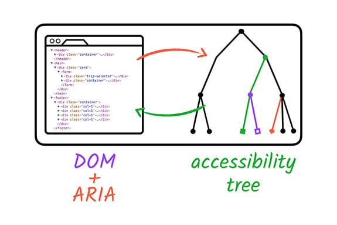

# ARIA và HTML

## Tổng quan

**HTML** là ngôn ngữ đánh dấu chuẩn của web hiện đại. **ARIA** (Accessible Rich Internet Applications) là bộ thuộc tính bổ sung giúp tăng khả năng tiếp cận.

Cả hai đều quan trọng trong việc hỗ trợ công nghệ hỗ trợ (AT) như trình đọc màn hình, chuyển đổi nội dung sang chữ nổi Braille hoặc giọng nói.

## Tại sao cần ARIA?

HTML đôi khi không đủ để mô tả đầy đủ chức năng của các thành phần phức tạp. ARIA bổ sung thông tin này cho công nghệ hỗ trợ.

## 🔍 Giới thiệu về ARIA

### Lịch sử
- **Phát triển:** 2008 bởi WAI (Web Accessibility Initiative) - thuộc W3C
- **Mục đích:** Hỗ trợ nội dung động và điều khiển giao diện nâng cao

### ARIA là gì?
**ARIA không phải ngôn ngữ lập trình** mà là tập hợp thuộc tính HTML bổ sung thông tin cho công nghệ hỗ trợ.

### Cây khả năng tiếp cận
- **Dựa trên:** Cây DOM chuẩn
- **Chức năng:** Cung cấp biểu diễn mà AT có thể hiểu
- **ARIA:** Sửa đổi và tăng cường cây này

> **💡 Lưu ý:** ARIA chỉ ảnh hưởng đến trải nghiệm AT, không thay đổi giao diện người dùng.



## 🧩 Ba thành phần chính của ARIA

### 1. **Role** (Vai trò)
Xác định thành phần là gì hoặc làm gì.

```html
<div role="button">Self-destruct</div>
```

### 2. **Properties** (Thuộc tính)
Thể hiện đặc điểm hoặc mối quan hệ.

```html
<div role="button" aria-describedby="more-info">Self-destruct</div>
<div id="more-info">This page will self-destruct in 10 seconds.</div>
```

### 3. **States/Values** (Trạng thái/Giá trị)
Xác định điều kiện hiện tại hoặc giá trị dữ liệu.

```html
<div role="button" aria-describedby="more-info" aria-pressed="false">
  Self-destruct
</div>
```

> **💡 Mẹo:** Sử dụng Chrome DevTools để xem cây khả năng tiếp cận và hiểu cách ARIA ảnh hưởng đến mã của bạn.

## ⚖️ Khi nào sử dụng ARIA?

### HTML5 vs ARIA
**HTML5 (2014)** đã bổ sung nhiều phần tử ngữ nghĩa:
- `<main>`, `<header>`, `<footer>`, `<aside>`, `<nav>`
- Thuộc tính `hidden`, `required`

**Kết quả:** Một số ARIA trở nên ít quan trọng hơn.

### Nguyên tắc cơ bản
- **HTML có vai trò ngầm định** → Không cần ARIA
- **HTML không đủ** → Cần ARIA bổ sung
- **ARIA vẫn hữu ích** cho nhiều vai trò, trạng thái không có trong HTML

## 📋 Năm quy tắc vàng của ARIA

WAI đã phát triển 5 quy tắc giúp quyết định khi nào và cách sử dụng ARIA.

### 🚫 Quy tắc 1: Không sử dụng ARIA (Don't use ARIA)

**Thực tế:** Thêm ARIA không nhất thiết làm tăng khả năng tiếp cận.

**Số liệu:** Trang có ARIA có **70% lỗi nhiều hơn** so với trang không có ARIA (WebAIM Million).

**Nguyên nhân:** Triển khai ARIA không đúng cách.

#### ❌ Không nên
```html
<a role="button">Submit</a>
```

#### ✅ Nên làm
```html
<button>Submit</button>
```

> **💡 Nguyên tắc:** Khi nghi ngờ, sử dụng phần tử HTML ngữ nghĩa.

### ⚠️ Quy tắc 2: Không thêm ARIA không cần thiết (Don't add (unnecessary) ARIA to HTML)

**Thực tế:** HTML thường hoạt động tốt mà không cần ARIA bổ sung.

**Vấn đề:** ARIA thường yêu cầu thêm mã JavaScript để hoạt động đúng.

#### ❌ Không nên
```html
<h2 role="tab">Heading tab</h2>
```

#### ✅ Nên làm
```html
<div role="tab"><h2>Heading tab</h2></div>
```

> **💡 Lợi ích:** Sử dụng HTML đúng mục đích = ít mã hơn, hiệu suất tốt hơn.

### ⌨️ Quy tắc 3: Luôn hỗ trợ điều hướng bàn phím (Always support keyboard navigation)

**Yêu cầu:** Tất cả điều khiển ARIA tương tác phải có thể truy cập bằng bàn phím.

**Giải pháp:** Sử dụng `tabindex="0"` cho phần tử cần tiêu điểm.

#### ❌ Không nên
```html
<span role="button" tabindex="1">Submit</span>
```

#### ✅ Nên làm
```html
<span role="button" tabindex="0">Submit</span>
```

#### 🎯 Tốt nhất
```html
<button>Submit</button>
```

> **⚠️ Cảnh báo:** Không thêm tabindex không cần thiết vào tiêu đề/đoạn văn - gây khó khăn cho người dùng bàn phím.

### 👁️ Quy tắc 4: Không ẩn thành phần có thể lấy nét (Don't hide focusable elements)

**Vấn đề:** `role="presentation"` hoặc `aria-hidden="true"` báo cho AT bỏ qua phần tử.

**Hậu quả:** Gây nhầm lẫn khi người dùng cố tương tác với phần tử bị ẩn.

#### ❌ Không nên
```html
<div aria-hidden="true">
  <button>Submit</button>
</div>
```

#### ✅ Nên làm
```html
<div>
  <button>Submit</button>
</div>
```

> **⚠️ Lưu ý:** Áp dụng cho tất cả phần tử có thể lấy nét, bao gồm `tabindex="0"`.

### 🏷️ Quy tắc 5: Sử dụng tên dễ hiểu ( Use accessible names for interactive elements)

**Yêu cầu:** Mọi thành phần tương tác phải có tên rõ ràng cho AT.

**Nguồn tên có thể truy cập:**
- Nội dung trong phần tử (như `<a>`)
- Văn bản thay thế (`alt`)
- Nhãn (`label`)

#### Ví dụ: Tên "Red leather boots"

```html
<!-- Link với text -->
<a href="shoes.html">Red leather boots</a>

<!-- Link với hình ảnh -->
<a href="shoes.html">
  
</a>

<!-- Checkbox với label -->
<input type="checkbox" id="shoes">
<label for="shoes">Red leather boots</label>
```

### 🔍 Cách kiểm tra
- **Chrome DevTools:** Xem cây khả năng tiếp cận
- **Trình đọc màn hình:** Test thực tế

> **💡 Mẹo:** Đọc thêm về test trình đọc màn hình trong mô-đun Công nghệ hỗ trợ.
## 🔧 ARIA trong HTML

### Khi nào kết hợp ARIA + HTML?
- **Hỗ trợ AT cao hơn** do hạn chế môi trường
- **Phương pháp dự phòng** cho HTML không được hỗ trợ đầy đủ

### Nguyên tắc triển khai
1. **Không ghi đè** vai trò HTML mặc định
2. **Giảm thiểu** sự trùng lặp
3. **Lưu ý** tác dụng phụ không mong muốn

### Ví dụ thực tế

#### ❌ Chỉ định sai vai trò
```html
<a role="heading">Read more</a>
```

#### ✅ Sử dụng đúng vai trò + mô tả
```html
<a aria-label="Read more about some awesome article title">Read More</a>
```

#### ❌ Vai trò trùng lặp
```html
<ul role="list">...</ul>
```

#### ✅ Giảm dư thừa
```html
<ul>...</ul>
```

#### ❌ Bỏ qua tác dụng phụ
```html
<details>
  <summary role="button">more information</summary>
  ...
</details>
```

#### ✅ Giải quyết tác dụng phụ
```html
<details>
  <summary>more information</summary>
  ...
</details>
```

> **💡 Ứng dụng:** ARIA đặc biệt hữu ích trong biểu mẫu. Xem mô-đun Learn Forms.
## ⚠️ Sự phức tạp của ARIA

### Thách thức
**ARIA rất phức tạp** - cần thận trọng khi sử dụng.

**Các yếu tố cần xem xét:**
- Tương tác bàn phím
- Giao diện cảm ứng  
- Hỗ trợ AT/trình duyệt
- Nhu cầu dịch thuật
- Hạn chế môi trường
- Mã nguồn cũ
- Sở thích người dùng

### Thực tế
> **💡 Quan trọng:** Khả năng tiếp cận không phải "được ăn cả ngã về không" mà là một phạm vi với nhiều vùng xám.

**Nhiều giải pháp có thể "đúng"** tùy thuộc vào tình huống cụ thể.

### Lời khuyên
- **Tiếp tục học hỏi** và thử nghiệm
- **Test thực tế** với người dùng
- **Mục tiêu:** Làm thế giới kỹ thuật số cởi mở hơn với tất cả mọi người

---

## 📚 Tài liệu tham khảo

- **Article** [](https://web.dev/learn/accessibility/aria-html)
- **Dev tool:** [Dev tool](https://developer.chrome.com/blog/full-accessibility-tree)
- **Mozilla Accessibility Guideline:** [Mozilla](https://developer.mozilla.org/en-US/docs/Web/Accessibility/ARIA)
- **5 Rules:** [Using ARIA](https://www.w3.org/TR/using-aria/)


